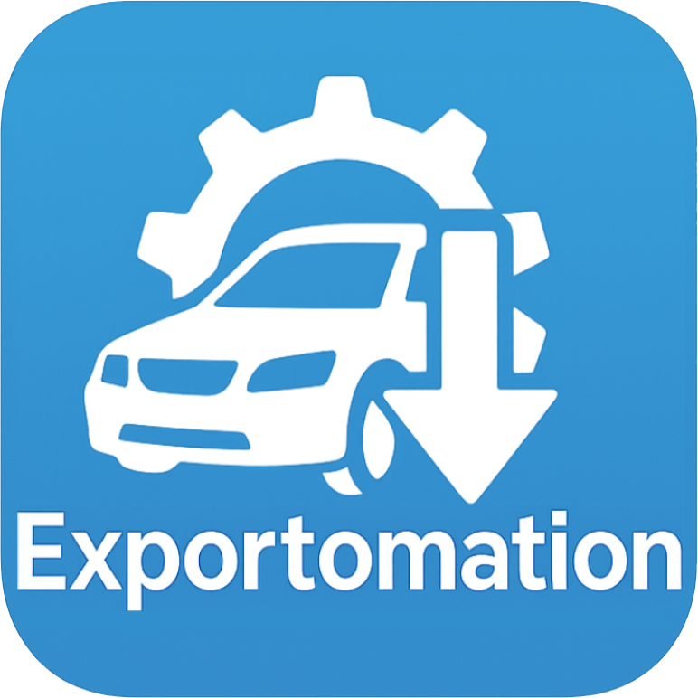
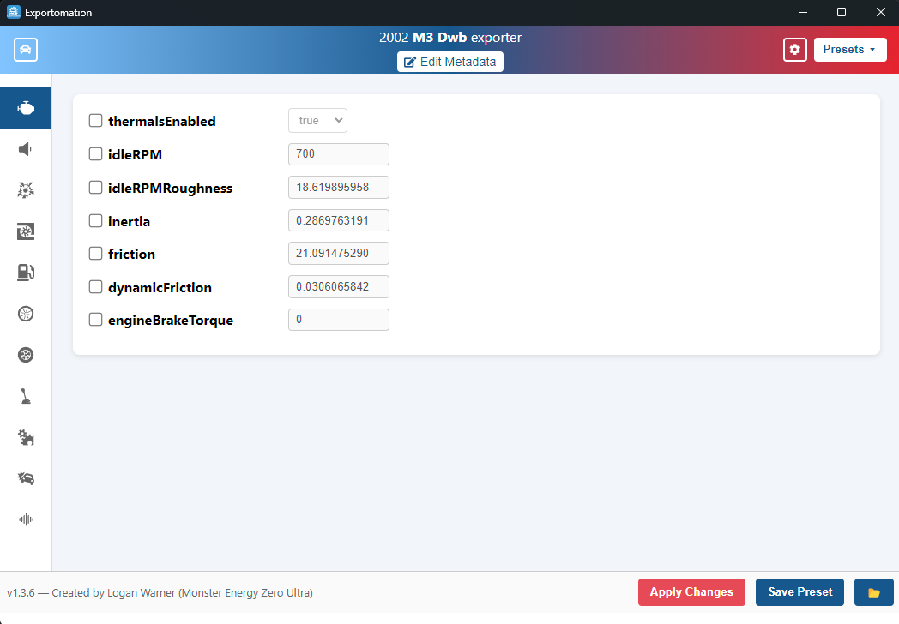

<p align="center">
  
</p>

# Exportomation

**Exportomation** is a tool that aims to make editing and quickly applying presets to Automation to BeamNG exports much easier and efficient.

<p align="center">
  
</p>

## Features
- Visual editor for general engine, exhaust, afterfire, and forced-induction params. More coming soon.
- Built-in Presets
- - Pre-loaded presets created by either myself or members of the community that can be useful for quick changes to exports
- Custom Presets
- - Create and Save your own custom presets so you can apply them to future exports in just a few clicks.
- Combine Presets
- - Both Built-In and Custom User Presets can be continuously stacked and combined via the ➕ button
- One-click apply changes to jbeam files

## Known Bugs/Flaws
 - Currently only works on unzipped exports. In the future I hope to add support for zipped.
 - Twincharged engine forced induction values cannot currently be edited, due to the nuances of my current parsing implementation.

## Installation (Windows)

1. Download the `Setup.exe` file from the [Releases page](https://github.com/ItsLoganWarner/exportomation/releases).
2. **Run the setup once.** It will install Exportomation like any other Windows app.
3. After install, you can launch Exportomation from the Start Menu.

### Upgrading

When a new version is released, simply download and run the new `Setup.exe` installer.  
Your existing settings and presets (both built-in and custom) live in `%APPDATA%/Exportomation/presets` and will **not** be overwritten unless you chose to overwrite built-in presets.

## Presets Folder

All presets (built-in and custom) are stored at:

`%APPDATA%/Exportomation/presets`

`├─ built-in/`

`└─ custom/`

You can browse this folder in-app via **File → Open Preset Folder** or manually in Explorer.

## Building from source
```bash
git clone https://github.com/ItsLoganWarner/exportomation.git
cd exportomation
npm install
npm run make


License
MIT © Logan Warner
Automation Discord: Monster Energy Zero Ultra (warrenboofit)